# Decor Nest

A Flutter e-commerce application for house decor products, built with MVVM architecture and modern development practices.

## Table of Contents

- [Overview](#overview)
- [Key Benefits](#key-benefits)
- [Features](#features)
- [Technology Stack](#technology-stack)
- [Installation](#installation)
- [Project Structure](#project-structure)
- [Branching Strategy](#branching-strategy)

## Overview

Decor Nest is a mobile application that allows users to browse, purchase, and manage house decor products. It includes features for product catalog, shopping cart, user authentication, and order management, providing a complete e-commerce experience for home decoration enthusiasts.

## Key Benefits

- **Easy Product Discovery** - Find and filter house decor items effortlessly
- **Secure Shopping** - Safe authentication and payment processing
- **User-Friendly Interface** - Intuitive design with theme customization
- **Responsive Design** - Optimized for all mobile screen sizes
- **Administrative Control** - Simple tools for product and order management

## Features

- **Product Catalog** - Browse and search house decor items with filtering and pagination
- **Shopping Cart** - Add, remove, and manage cart items with quantity controls
- **User Authentication** - Google Sign-In integration for secure account access
- **User Profile** - Manage personal information and account settings
- **Favorites System** - Save favorite products for quick access and comparison
- **Admin Panel** - Admin panel for product management, creation, editing, deletion, and search
- **Order History** - Users can view their order history and details
- **Dark/Light Theme** - Switch between themes for personalized experience
- **Offline Mode** - Shows connection status when internet is unavailable
- **Payment Integration** - Paymob payment processing for secure transactions

## Screenshots

<table style="border-collapse: collapse; border: none;">
  <tr>
    <td style="border: none;">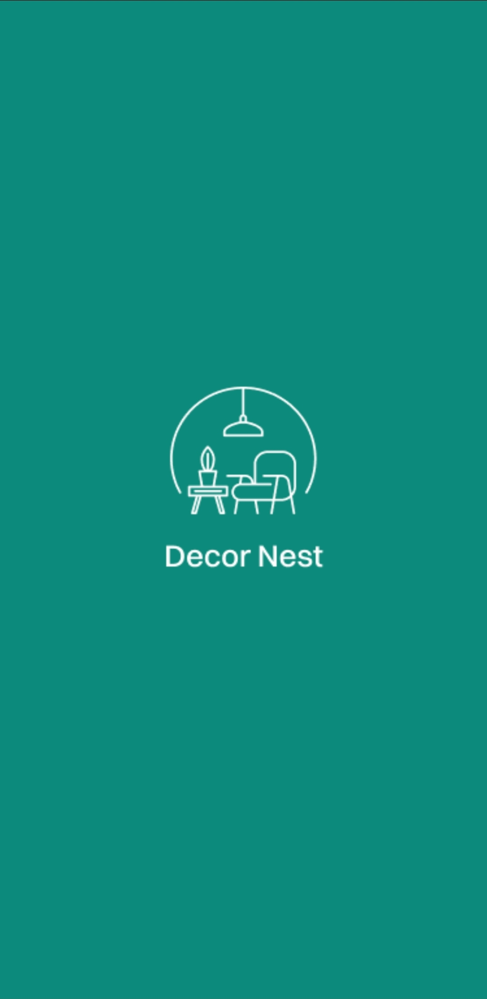</td>
    <td style="border: none;">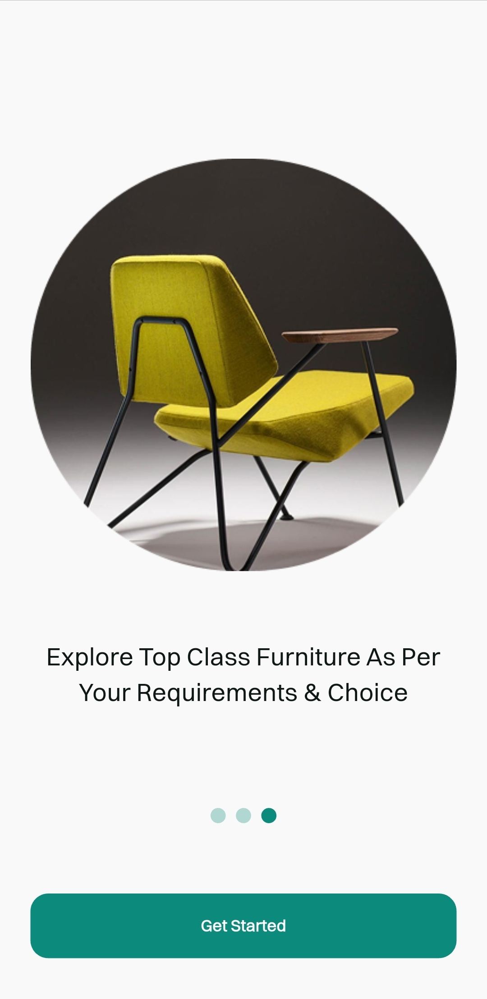</td>
    <td style="border: none;">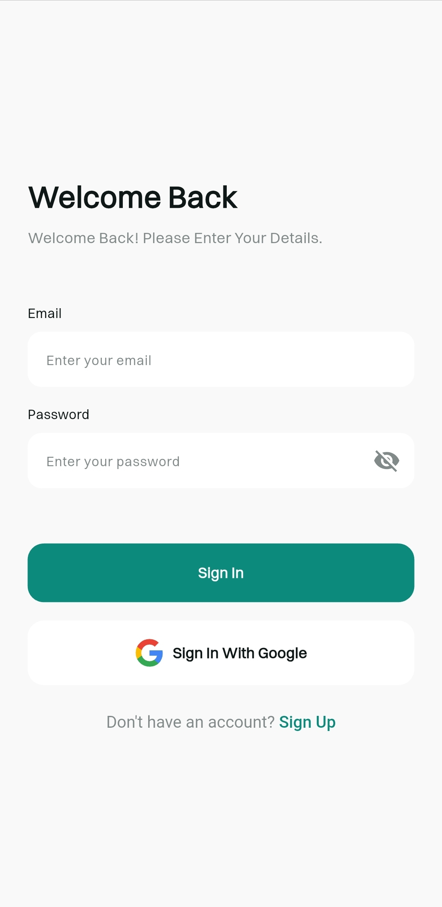</td>
    <td style="border: none;">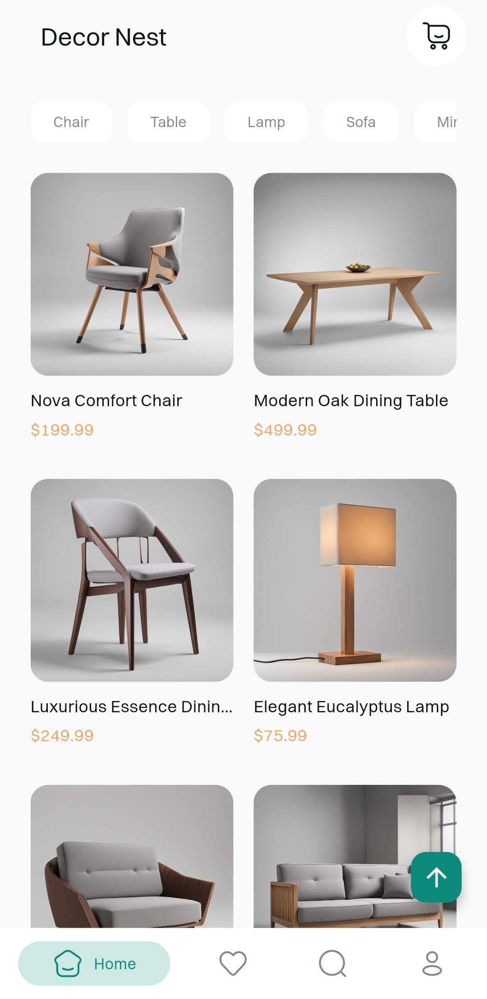</td>
  </tr>
  <tr>
    <td style="border: none;">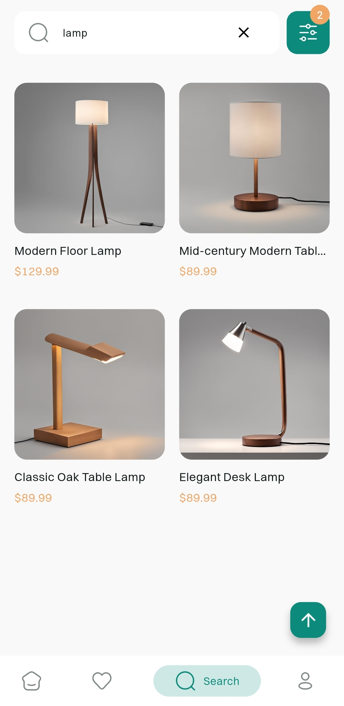</td>
    <td style="border: none;">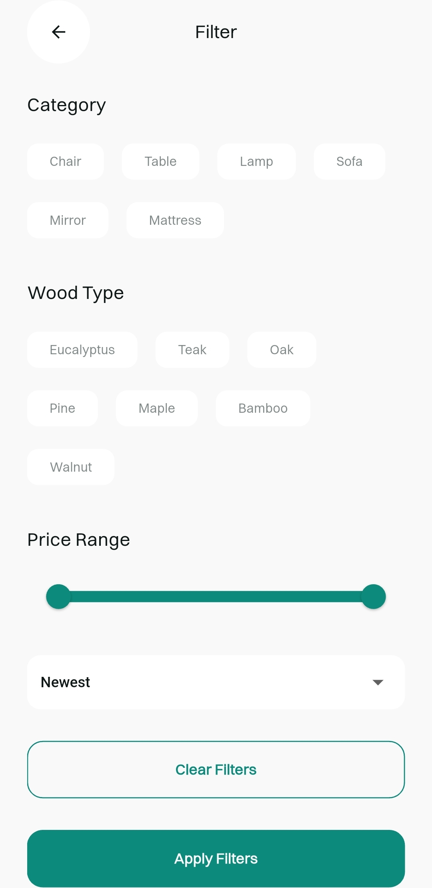</td>
    <td style="border: none;">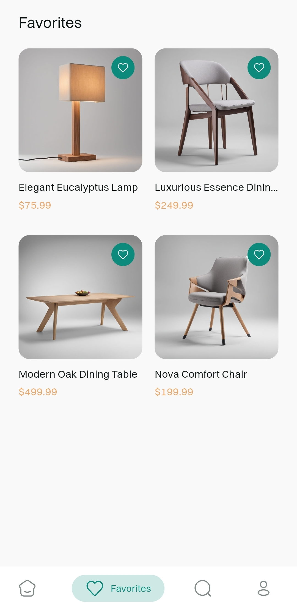</td>
    <td style="border: none;">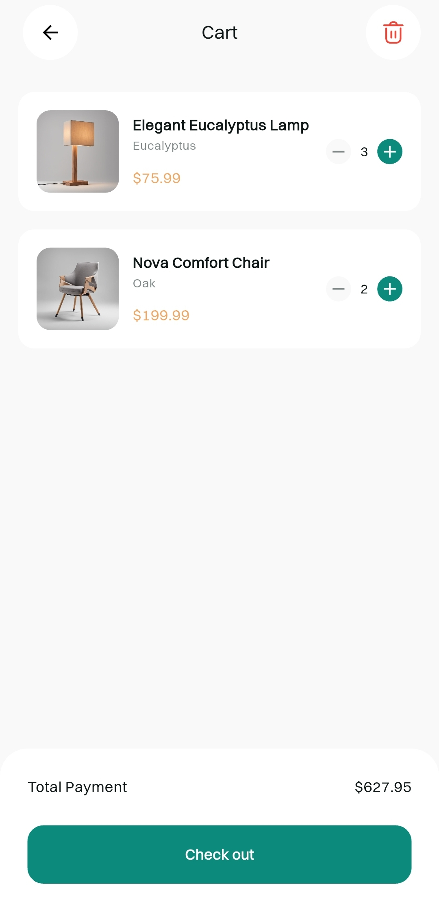</td>
  </tr>
  <tr>
    <td style="border: none;">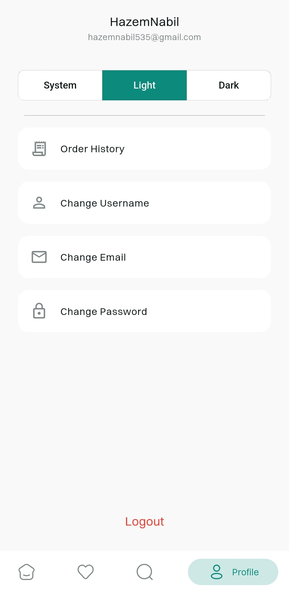</td>
    <td style="border: none;">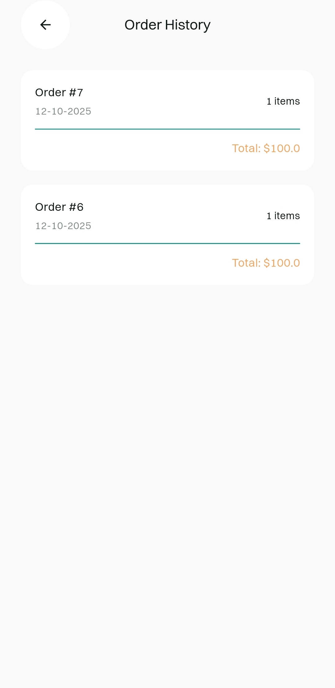</td>
    <td style="border: none;">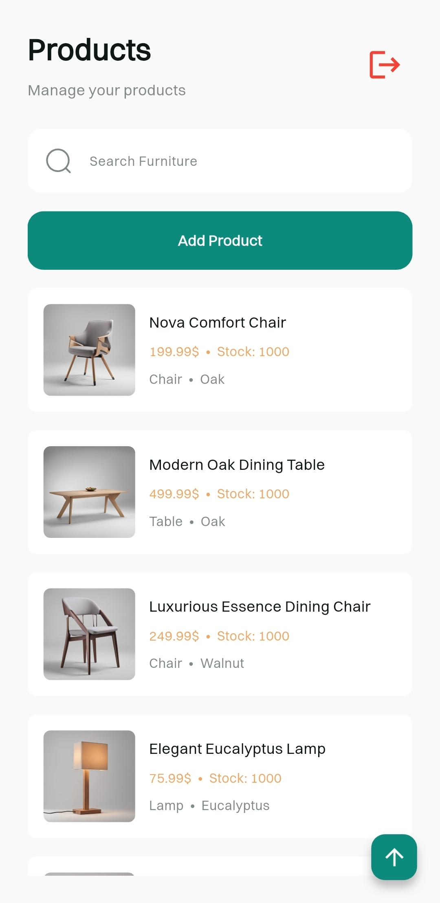</td>
    <td style="border: none;">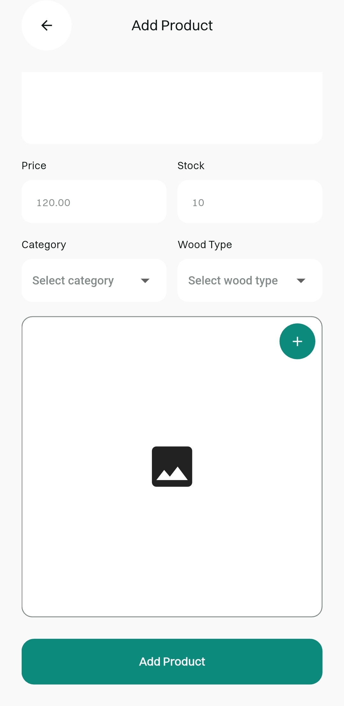</td>
  </tr>
  <tr>
    <td style="border: none;">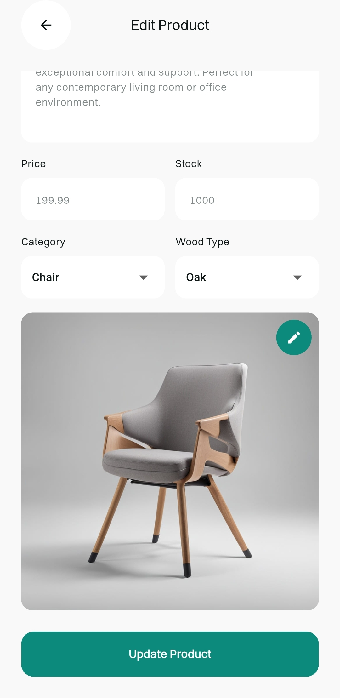</td>
    <td style="border: none;">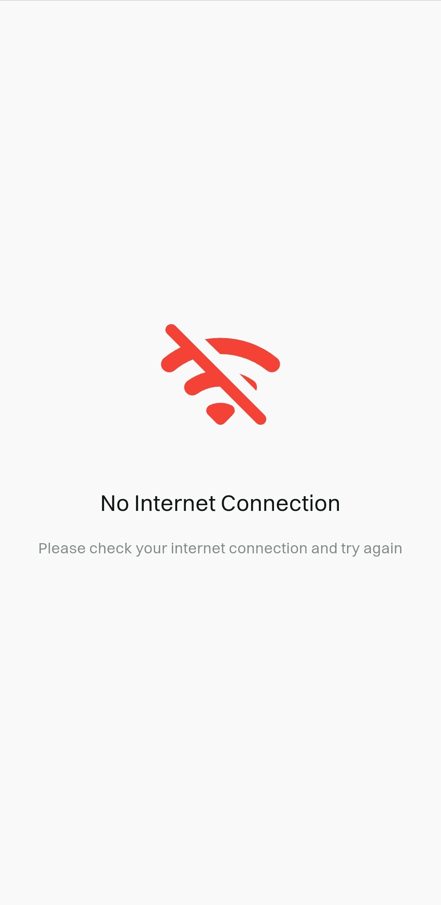</td>
  </tr>
</table>

## Technology Stack

| Component | Technology | Purpose |
|-----------|------------|---------|
| **Framework** | Flutter | Cross-platform mobile development |
| **Backend** | Supabase | Database and authentication |
| **State Management** | BLoC | Application state management |
| **Dependency Injection** | Get It | Service locator for dependency injection |
| **Navigation** | Go Router | Routing and navigation |
| **Payments** | Paymob | Payment processing |

## Installation

### Prerequisites
- Flutter SDK 3.32.7
- Supabase account
- Google Developer Console setup

### Setup
1. Clone the repository
2. Install dependencies: `flutter pub get`
3. Set up environment variables for Supabase and Paymob
4. Run the app: `flutter run`

## Project Structure

```
lib/
├── core/                         # Core application modules
│   ├── constants/                # App constants
│   ├── di/                       # Dependency injection
│   ├── errors/                   # Error handling
│   ├── helper/                   # Utility functions
│   ├── models/                   # Data models
│   ├── router/                   # Navigation setup
│   ├── services/                 # Core services
│   ├── themes/                   # Theme definitions
│   ├── view_models/              # State management
│   └── widgets/                  # Reusable components
├── features/                     # Feature modules
│   └── feature_name/             # Example feature structure
│       ├── data/                 # Data layer
│       │   ├── models/           # Feature models
│       │   ├── repos/            # Repositories
│       │   └── services/         # Services
│       └── presentation/         # UI layer
│           ├── view_models/      # State management
│           └── views/            # Screens and widgets
└── main.dart                     # Application entry point
```

## Branching Strategy

- **`main`** - Production-ready code and stable releases
- **`development`** - Active development and feature integration
- **`feature/feature-name`** - New feature development

---

Built with Flutter
